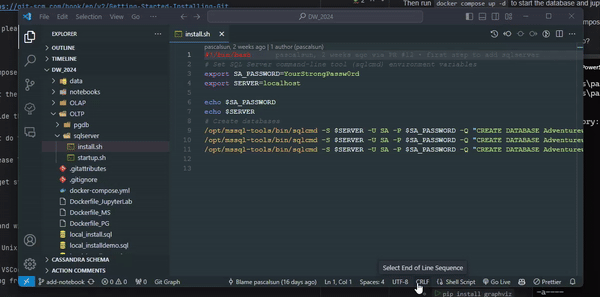
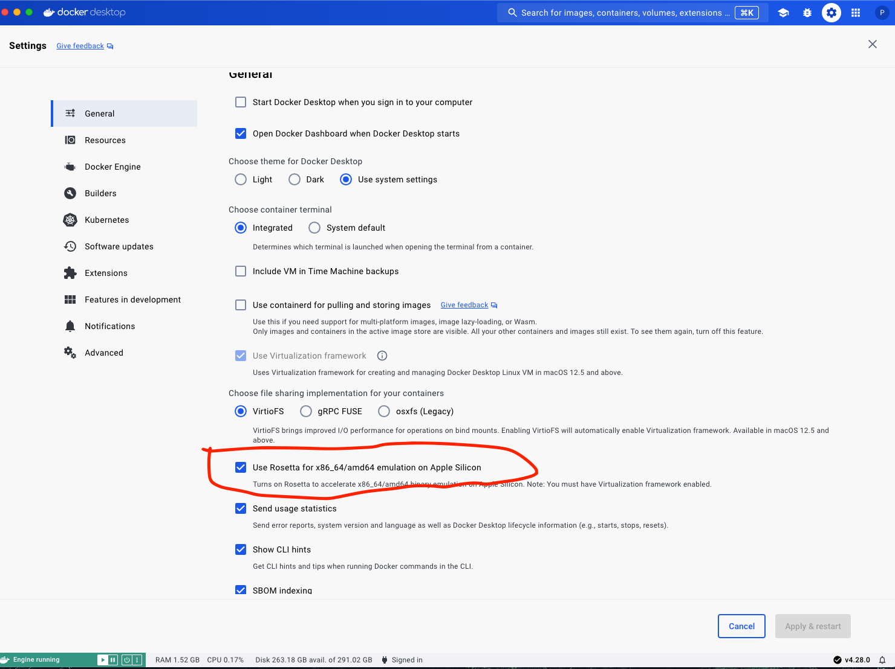

# UWA Data Warehouse 2024 Demo Project

## Overview

This project is designed to demonstrate the complete process of building a Data Warehouse, which involves several key stages:

1. **Data Collection and Settlement (OLTP - Online Transaction Processing):** This involves gathering and storing raw data, typically in an operational database.
2. **Data Transformation and Integration (ETL - Extract, Transform, Load):** The raw data is transformed and integrated into a unified format, making it suitable for analysis.
3. **Data Warehouse Design and Implementation (OLAP - Online Analytical Processing):** The data warehouse is designed, usually before the ETL process, to support complex queries and reporting.
4. **Data Analysis and Visualisation (BI - Business Intelligence):** The final stage aims to provide actionable insights, answer business questions, and support decision-making processes.

To illustrate these concepts, we use the fictitious `Adventure Works Cycles` database, representing a multinational manufacturing company that sells bicycles and accessories.

## Environment Setup

### Step 1: Cloning the Repository

To begin, clone the project repository:

```bash
git clone https://github.com/PascalSun/DW_2024.git
```

Familiarity with Git and GitHub is essential for software engineers. If you’re new to Git, here are some resources to get started:
- [W3Schools Git Tutorial](https://www.w3schools.com/git/)
- [Official Git Documentation](https://git-scm.com/book/en/v2/Getting-Started-Installing-Git)

Additionally, if you do not have a code editor, we recommend installing [VS Code](https://code.visualstudio.com/download).

### Step 2: Database Environment Setup

Ensure that Docker and Docker Compose are installed on your machine. These tools are necessary to set up the required databases and Jupyter Lab environment.

Start the services with the following command:

```bash
docker compose up -d
```

This will start the containers necessary for the project. You should have four running containers: `pgdb`, `pgadmin`, `sqlserver`, and `jupyterlab`. You can check this with:

```bash
docker ps
```

If any container is missing, check the logs for that container using:

```bash
docker logs -f <container_name>
```

#### Debug Hint

To confirm that all four containers are running, use:

```bash
docker ps
```

You should see four containers: `pgdb`, `pgadmin`, `sqlserver`, and `jupyterlab`. If one is missing, check the logs for that container:

```bash
docker logs -f <container_name>
```

#### Special Instructions for Windows Users

If you run the `docker compose up` command in PowerShell or the terminal provided by Windows, you might encounter issues with the `sqlserver` container due to line ending conflicts between Unix-based and Windows-based systems. To resolve this:

1. Open the project in VS Code.
2. Navigate to `OLTP/sqlserver/install.sh` and `OLTP/sqlserver/startup.sh`.
3. Change the line endings from `CRLF` to `LF` (in the bottom-right corner of VS Code).
4. Save the files and run:

   ```bash
   docker compose up --build -d
   ```



#### Special Instructions for Mac M1/M2/M3 Users

For users with ARM architecture, the `sqlserver` and `jupyterlab` containers may not start properly due to the `mcr.microsoft.com/mssql/server` image not supporting ARM architecture. To resolve this:

1. Enable `Use Rosetta for x86_64/amd64 emulation on Apple Silicon` in Docker settings:
   - Open Docker Desktop settings.
   - Go to the General tab.
   - Check the `Use Rosetta for x86_64/amd64 emulation on Apple Silicon` option.
   - Click `Apply & Restart`.

2. Clean the images and run:

   ```bash
   docker compose up --build -d
   ```



### Step 3: Local Python Development Environment Setup

While the project provides a `jupyterlab` container within Docker for development, you may also choose to set up a local Python development environment:

1. Install Graphviz and its Python package for drawing ER diagrams:
   - On macOS: `brew install graphviz`
   - Install the Python package: `pip install graphviz`

2. Create a virtual environment with Python 3.9 or higher:
   - Using `venv`:
     ```bash
     python3 -m venv venv
     source venv/bin/activate
     ```
   - Using `conda`:
     ```bash
     conda create -n dw python=3.9
     conda activate dw
     ```

3. Install the project dependencies:

   ```bash
   pip install -r requirements.txt
   ```

4. Run Jupyter Lab in the project directory:

   ```bash
   jupyter lab
   ```

### Step 4: Explore and Understand

This project encourages you to explore both the Docker and local development environments, understand their setups, and be prepared to discuss the advantages and disadvantages of each approach. This exploration is valuable for understanding the full lifecycle of a data warehouse project, from data collection to analysis and visualisation.

